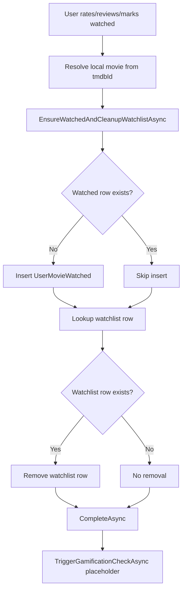

# Business Rules and Triggers (Movies Domain)

This document captures implemented business logic, security constraints, and ML/gamification placeholders.

## 1) Auto-Watch Rule

## Rule definition

When a user rates or reviews a movie, the system automatically treats that movie as watched.

Side effects:

1. Ensure one `UserMovieWatched` row exists for `(UserId, MovieId)`.
2. Remove the same movie from `UserMovieWatchlist` if present.

## Where this rule executes

The helper `EnsureWatchedAndCleanupWatchlistAsync(userId, movieId, ct)` is used by:

- `SetRatingAsync`
- `AddReviewAsync`
- `UpdateReviewAsync`
- `MarkWatchedAsync`

The helper is called before `_unitOfWork.CompleteAsync()` in those mutation flows.

## Idempotency and data integrity

- `UserMovieWatched` has a unique index on `(UserId, MovieId)`.
- The helper checks existing watched row first, then inserts only if missing.

This ensures repeated calls do not create duplicates.

## Practical flow

---

## 2) Review Ownership Constraint and IDOR Protection

## Core constraint

Movie reviews are scoped to `(UserId, MovieId)`.

- One review per user per movie.
- No direct route with reviewId for update/delete.
- Current user can only update/delete their own review.

## API shape

- `POST /api/movies/{tmdbId}/reviews` - create current user review.
- `PUT /api/movies/{tmdbId}/reviews` - update current user review.
- `DELETE /api/movies/{tmdbId}/reviews` - delete current user review.

## Security mechanism

1. Controller extracts `userId` from authenticated claims.
2. Service queries by `UserMovieReviewByUserAndMovieSpecification(userId, movieId)`.
3. If no review for that user/movie pair, returns `ReviewNotFound`.

Because ownership is embedded in query criteria, users cannot modify another user review by manipulating route/body data.

## Database backing

`UserMovieReviewConfiguration` enforces unique index:

- `(UserId, MovieId)` is unique.

This protects against duplicate reviews at DB level.

---

## 3) Trigger and Validation Summary

## Rating trigger

- Validates stars in range 1..5.
- Upserts `UserMovieRate`.
- Auto-watch + watchlist cleanup.
- Commits via unit of work.
- Calls gamification placeholder.

## Review create/update trigger

- Validates review body (required, max length).
- Create: rejects duplicates with `ReviewAlreadyExists`.
- Update: requires existing owned review.
- Auto-watch + watchlist cleanup.
- Commits via unit of work.
- Calls gamification placeholder.

## Explicit watched trigger

- Ensures watched row and cleanup.
- Commits via unit of work.
- Calls gamification placeholder.

---

## 4) ML Placeholders and Future Integration Points

## A) `recommended-for-me` fallback (PrimaryInterest-aware)

Endpoint:

- `GET /api/movies/recommended-for-me` (auth required)

Current logic (fallback only):

1. Load user and read `ApplicationUser.PrimaryInterest`.
2. Get candidate movies from local placeholder specs.
3. If empty, use trending-fallback spec.
4. Selection strategy:
   - `PrimaryInterest == Movies`: top ordered candidates.
   - `PrimaryInterest == Mixed or Games`: broaden set, randomized sampling.

No collaborative filtering/content model is used yet.

## B) Review sentiment placeholder

`UserMovieReview.Sentiment` exists as nullable field (`max length 32`).

Current behavior:

- Create/update review keeps sentiment null.
- Sentiment is returned in `MovieReviewDto`.

Future ML integration options:

1. Async post-processing after review write.
2. Batch sentiment jobs over historical reviews.
3. Feed sentiment signal into recommendation ranking.

## C) Gamification hook placeholder

`TriggerGamificationCheckAsync(userId)` is currently a no-op and is intentionally invoked from rating/review/watched flows.

Future uses:

- Achievement unlocks.
- Streak tracking.
- XP and progression updates.

---

## 5) Recommended ML Team Integration Contract

1. Keep writes on interaction paths fast; execute heavy ML work asynchronously.
2. Preserve current API response contracts while enriching internals.
3. Treat `tmdbId` as external identity key, local `MovieId` as persistence key.
4. Reuse existing trigger points before introducing new endpoint-level side effects.
5. Keep one source of truth for ownership constraints (`UserId + MovieId`) to preserve anti-IDOR behavior.
